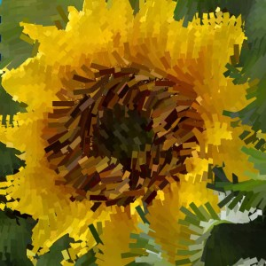
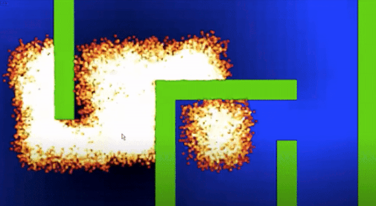
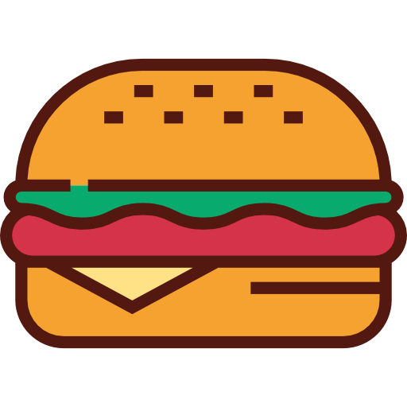
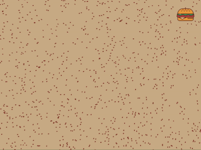
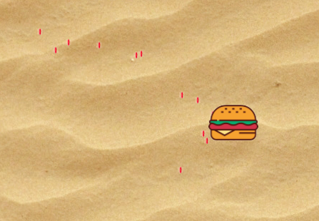
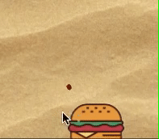

# ROBOTA PSYCHE ASSIGNMENT 2: Burger-Ant Flow Field

My project for this week mader use of a flow field to visualize a hoard of ants following the scent of a left out burger, using PVector array lists and seeking the location of the "burger", which was the mouse.

## PROCESS

When first starting the project, I was not sure of what behavior out of the ones I suggested I wanted to do. Just from researching on Google alone, I thought about doing a bunch of vectors creating an avant-garde version of an image, but I figured that would be too difficult considering the knowledge I have.

Thinking about the behaviors I came up with last class, what attracted to me was a flow field used to look for your phone by just following the noise. This led me to searching projects related to this. This is what led me to a [video](https://www.youtube.com/watch?v=Bspb9g9nTto&ab_channel=Tuts%2BGameDevelopment) describing what is called "goal-based vector field pathfinding", wherein we dictate a specific location to a bunch of vehicles to go.

Deciding this was my idea of choice, it was time to get coding. However, this was harder than I thought.

## SETBACKS

### 1. Movement

Because we didn't specifically learn how to make an array of vehicles follow the mouse in a realistic, lifelike fashion, I spent a few hours looking over codes and projects that would help me. After finding a fairly simple one asking about the direction of arrows based on the mouse direction, I based my project off of that.

However, soon scrapping this idea, I began to make use of Professor's code to show a triangle randomly moving across the screen. Deciding to play with this by changing the background color and increasing the amount of vehicles, it reminded me highly of a bunch of ants walking across their anthill. I decided to base my project on this scenario.

### 2. Goal Orientation

After choosing my topic, I didn't want to just make it a bunch of ants walking around the screen with no clear goal. I then remembered that the reason ants pop up in places are due to food laying around. I decided to go with adding a burger and make the ants walk to it.

Because I got inspiration from another code that made use of particles in an easier way, it took time for me to add the seek function as I had to change it accordingly. The ants are a bunch of lines with a thick stroke.

### 3. Realistic and Constant Movement

After getting the goal orientation down, I didn't want the ants to merely go to one place, as they merely disappear and don't crowd around the burger as I would have liked. Because of this, I decided to make the postion of the burger be relative to the mouse's location and have the ants move accordingly.

I had a hard time making the ants move at first, but it was because I was declaring the mouse vector inside setup() instead of draw(), not allowing it to update.

### 4. Appearance of Ant

I tried different appearances for my ant, such as changing the color from dark red to bright red, changing the line to an ellipse, and even making it a real png file of an ant (which failed miserably because it caused it to lag so much). In the end, I just stook with the dark red lines.

### 5. Ants Coming to One Location

Weirdly, when I move the burger around enough, the ants begin to move in one uniform line, and ultimately in one uniform location, making it look like they're just one ant. This was not something i was able to fix, unfortunately, but the presence of an arraylist on mouseclick changed it greatly.

### 6. Changing from Array to Array List

Because I only realized late that we had to make our vehicles appear in an array list, I ended up taking some time to change my code to fit an array list instead of an array. 

The biggest change is that, instead of all the ants appearing once the program loads, you have to trigger them with a mouse click, which makes them appear in a random location. Weirdly also, Processing didn't allow me to run a vector inside of a particle, even though that was what was shown in the Dan Shiffman website:

    for (int i = 0; i < 10; i++) {
        myVectors.add(new PVector(i, 0));
      }
After I got it to work, however, I was very happy because it looked a lot more realistic, as it looks like the ants are emerging from the sand.

## FINAL

Finally, my project is done! The final gif of the program (slightly sped up for the purpose of turning the video into a gif file) is below:

