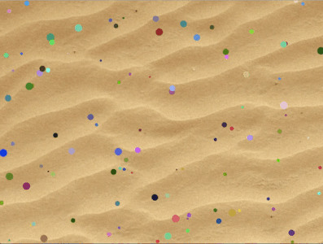
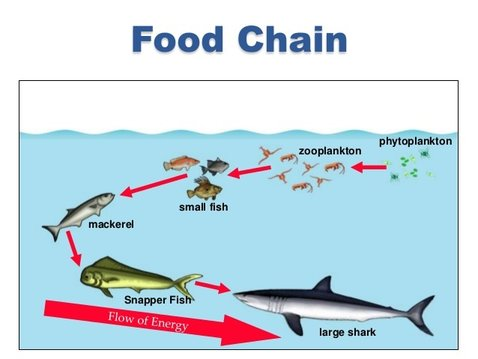
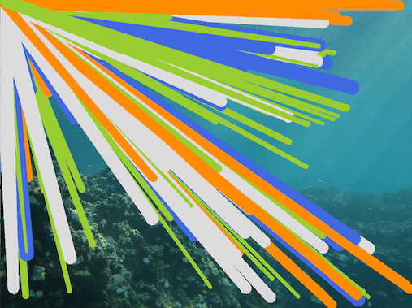
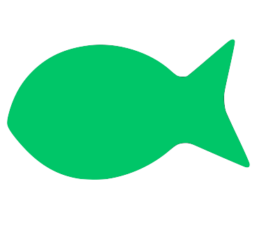
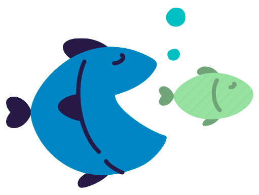

# ROBOTA PSYCHE ASSIGNMENT 3: Sea of Fishes Behavior

For this assignment, we were instructed to start implementing forms of DNA and behaviors that will cause adding and subtracting of multiple vehicles. My code, though not doing implementing the behaviors I want yet, creates a lively sea of fish (different colors and sizes) moving in random directions. I want to code it so that, when a small fish comes in close contact with it predator, it will disappear, and when it comes close to a similar fish, will reproduce another fish of that species.

## PROCESS

Because I thought that I would continue using my ant hill example, I wanted to develop my previous code. Pullling it up, I realized that I had to change a lot of the structure due to my new use of the expanded Arraylist. This assignment was quite difficult due to me not completely understanding the concept. I have quite a few setbacks that occured with coding this, the farthest I got was changing the size and color using the getDNA() function.

## SETBACKS

### 1. DNA Class

Creating the DNA class was already a difficult task, as I never had to implement different colors and sizes to particles in the same class. I first started off using an array of numbers that would pertain to size and color. Later on did I realize this wasn't necessary and just used normal int and color variables.

    class DNA {
     int[] size = new int[100];
     color[] colors = new color[100];

      DNA() {
        for (int i = 0; i < size.length; i++) {
          size[i] = int(random(0,50));
        }

      for (int i = 0; i < colors.length; i++) {
          colors[i] = int(random(0,255));
        }
      }
    }

### 2. Using DNA Variables in Particle Class

However, even after figuring this out, I didn’t know how use getDNA() function in Particle class if all the variables are in DNA class. After researching about it, I stumbled upon this [link](https://discourse.processing.org/t/get-class-variables-from-another-class/14866/6) about using public classes and accessing functions from a different class. After using this, it started working the way I wanted to.

     void getSize() {
    strokeWeight(size);
      }

      void getColor() {
        stroke(colors);
      }

      void getDNA() {
        gene.getSize();
        gene.getColor();
      }

I then realized that all my particles were in black and white, which may have been cause by me using 3 different variables for RGB instead of using a color funciton. Realizing this, I did this and it became multicolored. In addition, I also wanted to stop making the particles follow the mouse, so I settled for the random movement instead.

### 3. Changing the Theme

I don't know why, but the particles reminded me of fish, leading me to want to change the anthill to a sea. After getting everything to work properly, I began changing the theme to what I wanted.

Because I wanted to make this like an ecosystem, I coded the color of the particles to be a certain color depending on their size (green for sizes 5-10, etc.).

      size = int(random(5, 30));
    if (size < 15 && size >= 5) {
      colors = color(154, 205, 50);
      foodchain = 0;
    }

This was inspired by the concept of the food chain in bodies of water: the small particles would become plankton, the orange particles were small fish, the grey fish become makerel, and the blue particles are sharks.

### 4. Making Particles Look Like A Fish

Because this was a sea, I didn't want the fish to just look like a bunch of circles, which was something I could get away with for the anthill because ants are small. I first tried using Processing shapes like triangles; however, I wasn't really sure to do this. As a result, my canvas turned out looking like a firework, which could be nice as an art project but not something I was looking for right now.

I was also thinking about using a PNG file of a fish, however remembering from previous assignments, using a picture slows down the program by a lot, so I can't imagine having to use 100 of the same PNG file. 

### 5. Using 'Separate' and 'Apply Behavior' Function

I'm not sure why, but my separate function doesn’t work! It gives me an error that "Type mismatch, "void" does not match with "processing.core.PVector"". Thinking that this was due to the function being a void instead of a PVector, I tried changing separate into a PVector instead of a void, but it didn't work either. It would give me "This method must return a result of type PVector". As a result, I also couldn't use the "Apply Vector" function.

### 6. Making the Fishes Eat Each Other

I wanted the code to make it so that when a small fish is in contact with big fish it dies. However, because I need the size to apply the if() function, I couldn't do this because I can’t access size variable in the DNA class in the Particle class. I thought I could store the size variable from the DNA class into something in the Particle class, but it wasn’t possible.

## FINAL AND GOALS FOR THE FUTURE

What I was able to do so far is in the gif below, where I was only able to mass-apply the different sizes and shapes to the 100 particles present, as well as make them move in different directions. My goal for the future is to make it so that the small fishes get eaten by their respective predator, and reproduce when in close contact with a similar fish. 

