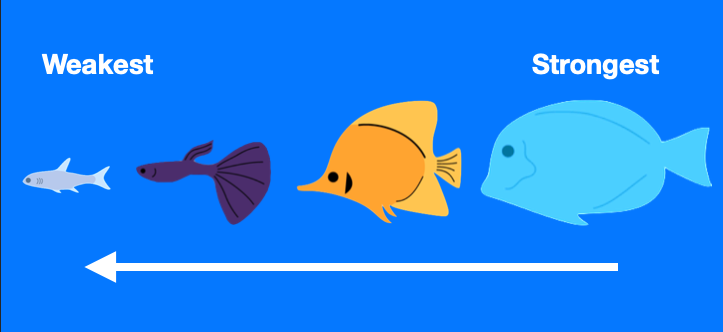
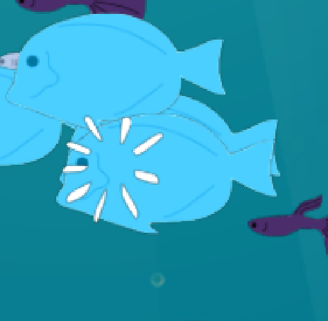
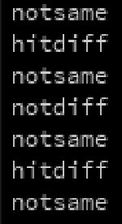
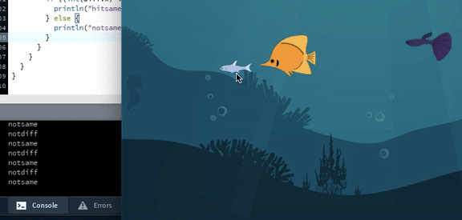

# ROBOTA PSYCHE ASSIGNMENT 4: Sea of Fishes Behavior (Continued)

For this assignment, we were instructed to start implementing forms of DNA and behaviors that will cause adding and subtracting of multiple vehicles. My code, though not doing implementing the behaviors I want yet, creates a lively sea of fish (different colors and sizes) moving in random directions. I want to code it so that, when a small fish comes in close contact with it predator, it will disappear, and when it comes close to a similar fish, will reproduce another fish of that species.

## WHERE I LEFT OFF

Reworking the code I had from before, I wanted to implement a behavior that makes it so that, when a bigger fish collides with a specific smaller fish, the smaller fish will disappear, indicating that it has been "eaten". A big fish cannot eat any small fish; instead, it can only eat the small fish directly under them in the food chain. The hierarchy is below:

## NEW FEATURES

### 1. Burst And Blood Collision Animation

Originally for my benefit, I coded so that a burst animation would appear whenever two fish of the same species appear, and for blood to appear whenever two fishes of different species (on the hierarchy) would appear.

## SETBACKS

### 1. Collision Between Objects of the Same Class

I thought that, because the fishes were all from the same class, it would be difficult to figure out how to treat each object as an individual entity. However, from reworking some of Professor's code regarding the separate function, I found out that there is a certain syntax for() loop for this called "for (Particle other : particles)", which allows you to get values from another particle in the same class.

Using this, I calculated the distance between the fishes and put if functions to determine if they should be eaten or not, such as if the difference between the two fish numbers is equal to 1 (indicating their one step above in the food chain) or equal to 0 (indicating they're the same species).

### 2. Fishes Getting Stuck

Sometimes, when fishes of the same species collide, it causes them to stop moving, therefore making the burst animation stay. Unfortunately, I'm not sure how to fix this.

