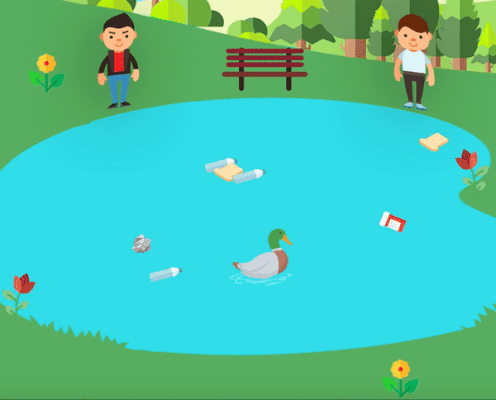
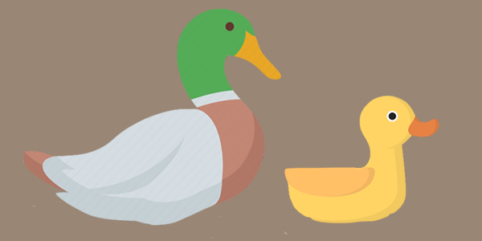
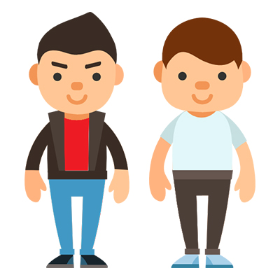

# ROBOTA PSYCHE ASSIGNMENT 5: Duck, Trash, and Bread

For this assignment, we were instructed to finish our project from March 1st. I had my fish ecosystem project, where, if two fish of the same species collided, they would reproduce a fish of the same species. However, I was having difficulties with the fact that the fishes would reproduce more than once.

I have spent *countless* days trying to debug and talk with Professor about my problems, but I couldn't find a solution to it. So, for the sake of my mental health, I decided ot create a whole new project in inspiration to my previous project (I ended up finding the solution to my fish ecosystem while creating the new project but more on that later!)

## SUMMARY

My new project consists of a duck in a pond that you control with the arrow keys. In the background, we see two boys. The rowdy boy on the left throws trash and the good boy on the right throws bread. Your goal is to direct the duck towards the bread while avoiding the trash. If you eat the trash, the duck gets sick. If he eats bread, he turns happy.

## INSPIRATION

I actualy first wanted to create an ecosystem similar to my first project. I would gather older ducks and ducklings and they would swim around in the pond, maybe even the ducklings following the duck.

I gathered images from the internet to use: however, when I began to think about it, what would the ducks and ducklings do? Just swim? I wanted to put something more. I ended up abandoning this idea and decided to do something like ducks swimming towards bread to eat it. However, it didn't look as realistic as I would like.

## FEATURES

The features of my project are as follows:

### 1. Good Boy & Rowdy Boy

Because I needed a back story as to why there was pieces of trash and bread being thrown around in the pond, I decided to put two boys in the background to make it look like they're the ones throwing it. I actually originally made it so that, when you liked the rowdy boy, he would throw a trash, and if you clicked the good boy, he would throw the bread. However, when I thought about it, if the player's goal is to make the duck eat bread, they'll never click the rowdy boy! I decided to remove this feature.

### 2. Eating Trash & Bread

Because I wanted to do something related to ducks, I immediately thought of bread being thrown in the water, because the random flow field gives a movement similar to water. I got a PNG file of a piece of bread, but I thought it was too boring if it's just bread alone. With this said, I gathered different pieces of trash the duck has to avoid.

### 3. Duck States

When I created the function to make the trash and bread disappear when the duck "eats" it, I wanted to make some states of the duck to make it obvious to the player that they ate a piece of trash or bread. I edited the duck looking sick and happy to signify if it ate trash or bread respectively.

## SETBACKS

### 1. Producing More Than One Piece of Trash

I thought that, because the fishes were all from the same class, it would be difficult to figure out how to treat each object as an individual entity. However, from reworking some of Professor's code regarding the separate function, I found out that there is a certain syntax for() loop for this called "for (Particle other : particles)", which allows you to get values from another particle in the same class.

Using this, I calculated the distance between the fishes and put if functions to determine if they should be eaten or not, such as if the difference between the two fish numbers is equal to 1 (indicating their one step above in the food chain) or equal to 0 (indicating they're the same species).

### 2. Changing State of Duck Depending On What It Eats

Sometimes, when fishes of the same species collide, it causes them to stop moving, therefore making the burst animation stay. Unfortunately, I'm not sure how to fix this.

